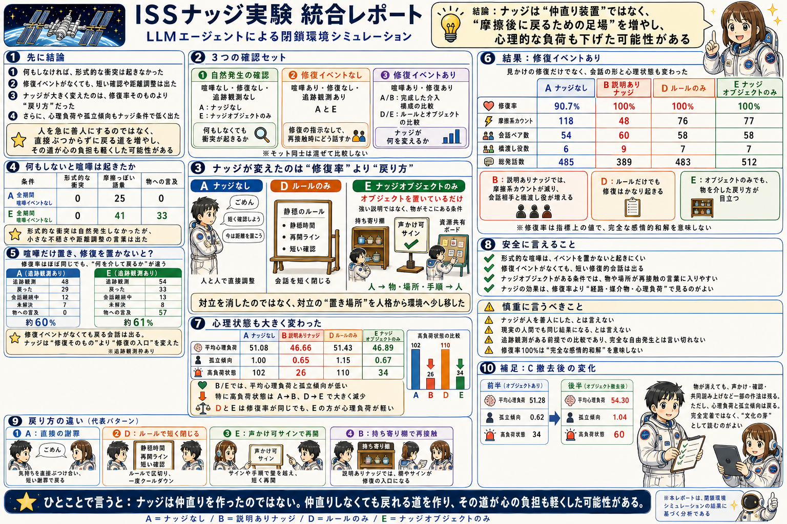
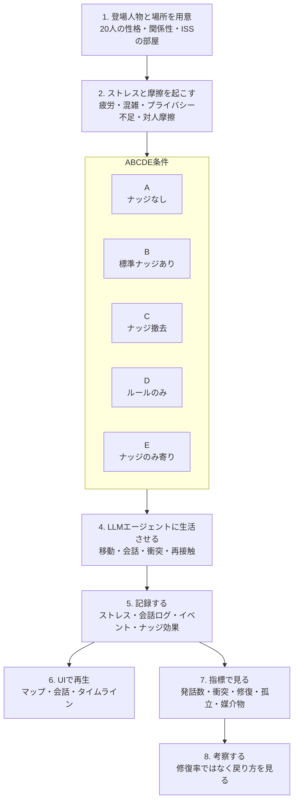

# GOOD ECHO｜仲直りしなくても戻れる道をつくる



**Demo:** [GitHub Pagesで開く](https://karesansui-u.github.io/hackathon-singulab-inu/visualization/iss_habitat_demo.html)

GOOD ECHOは、善性を個人の性格だけに任せず、空間・物・ルール・会話の設計によって支えられるかを検証するシミュレーションプロジェクトです。

最初の題材として、ISSのような閉鎖環境を用意し、LLMエージェントがストレス、混雑、孤立、衝突、短い再接触をどのように経験するかを観測しています。

## いちばん短い結論

この実験で見えたナッジの効果は、単純に「仲直りを増やすこと」ではありません。

> ナッジは仲直りを作ったのではない。
>
> 仲直りしなくても戻れる道を作った。

ナッジなしでも、摩擦後に謝罪、境界確認、短時間化のような修復的な言葉は出ます。重要なのは、ナッジあり条件では、持ち寄り棚、OKサイン、リソース・スコアボード、投票パネルなどが、気まずさを残したまま再接触するための足場になったことです。

つまり、GOOD ECHOが見ているのは「人を急に善人にする装置」ではなく、**高ストレス下で善性が壊れにくい環境インフラ**です。

## 公開デモ

GitHub Pagesで公開しています。

https://karesansui-u.github.io/hackathon-singulab-inu/visualization/iss_habitat_demo.html

UI上部のセレクトボックスから、20人/100ステップのA/B/D/E条件、10人/100ステップのC条件、修復イベントなし軸、喧嘩イベントなし軸を切り替えられます。


高解像度版は [MP4動画](assets/iss20_100_demo.mp4) を開いてください。

## メイン実験: A/B/C/D/E

メインで見ているのは、次の5条件です。

| 条件 | 内容 | 見たいこと |
|---|---|---|
| A | ナッジなし | 閉鎖環境ストレスだけで、衝突、孤立、修復がどう出るか |
| B | 標準ナッジあり | ナッジオブジェクトと運用文脈を含む完成パッケージが、摩擦を短くし、再接触を支えるか |
| C | ナッジ撤去 | 前半で置いたナッジを後半で消しても、声かけや確認の作法が残るか |
| D | ルールのみ | 「短く確認する」「静穏時間を置く」「再開時刻を決める」だけで、どこまで修復できるか |
| E | ナッジのみ寄り | 物や場所が、会話の媒介物や戻り口として使われるか |

読み方としては、AからEまでを単純な順位で比べません。

- **A/B:** 完成した標準介入パッケージの実用的な差を見る
- **C:** ナッジ撤去後に作法が残るかを見る
- **D/E:** ルールと物の違いを見る
- **A/Eの補助軸:** 修復イベントなしでも、戻り方が変わるかを見る

## 何が見えたか

### 1. ナッジなしでも修復的な言葉は出る

全期間修復イベントなし条件では、Aナッジなしでも48件中29件、Eナッジありでも54件中33件が修復的なstatusになりました。率だけ見ると、Aが約60%、Eが約61%です。

ここから、ナッジを「修復発生率を単純に上げる装置」とは言いにくい。

### 2. 変わったのは修復の経路

Aでは、本人同士が直接言葉で戻ります。

- ごめん
- 言いすぎた
- 短く確認しよう
- 今は距離を置こう

EやBでは、物や場所を介して戻ります。

- 持ち寄り棚で
- OKサインの下で
- スコアボードを見ながら
- 投票パネルだけ確認して

ナッジは、相手の人格へ直接踏み込まずに、作業関係へ戻るための第三項として働いています。

### 3. ルールとナッジは同じではない

Dルールのみは、会話を短く閉じる力が強い条件です。

Eナッジのみは、戻る場所や口実を作る条件です。

短く言うと、次の対比になります。

| 介入 | 主な働き |
|---|---|
| ルール | これ以上踏み込まない境界を作る |
| ナッジ | ここからなら戻れる接点を作る |

閉鎖環境では、どちらも重要です。ルールで過干渉を止め、ナッジで再接触の入口を作る、という設計が見えてきます。

### 4. 創発は「喧嘩」ではなく「戻り方」に出ている

喧嘩イベントなし条件では、形式的な `conflict` はA/Eとも0でした。したがって、「LLMエージェントが自然に喧嘩を始めた」とは言いません。

一方で、routine会話の中には小さな不穏さや距離調整が出ます。また、修復イベントなしでも、摩擦後の追跡観測では短い確認、謝罪、回避、物を介した再接触が出ます。

創発を言うなら、衝突の自然発生ではなく、**摩擦後にどう戻るかの作法**として読むのが安全です。

## 根拠サマリ

| 比較 | 主な結果 | 根拠 |
|---|---|---|
| A/B | BはAより総発話数が少なく、摩擦系カウントが少なく、会話ペアと橋渡し役が増えた | `outputs/runs/iss20_llm_ab_100step_metrics.json` |
| D/E | 修復率や会話ペア数はほぼ同じだが、物語彙行はD=0、E=164 | `outputs/runs/iss20_rule_vs_nudge_llm_metrics.json`、`messages.jsonl` |
| A/E 全期間修復イベントなし | 修復的status率はほぼ同じだが、Eでは物語彙行が57 | `outputs/runs/iss20_all_no_repair_axis_llm_metrics.json` |
| A/E 全期間喧嘩イベントなし | 形式的な `conflict_events` はA/Eとも0 | `outputs/runs/iss20_no_conflict_axis_llm_metrics.json` |
| C ナッジ撤去 | 撤去後も一部の声かけ作法は残るが、stress/isolationは戻る | `docs/ISS/reports/2026-05-05_iss_run_c_nudge_removal_claude_sonnet46_report.md` |

詳しい証拠素材は次に集約しています。

- [ISSナッジ実験 統合考察](docs/ISS/reports/2026-05-06_iss_nudge_experiment_integrated_discussion.md)
- [GOOD ECHO 詳細エビデンス・ドシエ](docs/ISS/reports/2026-05-06_good_echo_evidence_dossier.md)
- [GOOD ECHO cross experiment paper draft](docs/ISS/reports/2026-05-06_good_echo_cross_experiment_paper_draft.md)

## 実験パイプライン

登場人物と閉鎖空間を用意し、あえて摩擦イベントを起こし、AIエージェントの会話から「何を置くと関係が壊れにくいか」を調べます。



## 補助実験

ABCDEの読みを支えるために、次の補助軸も作っています。

| 補助軸 | 内容 | 役割 |
|---|---|---|
| A/E Step50以降修復イベントなし | Step50以降だけ `repair` イベントを抜く | 前半の修復経験が後半に残るかを見る |
| A/E 全期間修復イベントなし | Step1から最後まで `repair` イベントを置かない | 修復イベントなしでも短い再接触が出るかを見る |
| A/E 全期間喧嘩イベントなし | `conflict` / `repair` / `followup` を置かない | 形式的な喧嘩がイベント依存かを見る |

注意点として、修復イベントなし条件にも `followup` 観測枠はあります。したがって、「完全自由生活で勝手に仲直りした」とは言いません。正しくは、「摩擦後の同じペアを再観測すると、LLMは短い確認や修復的な言葉をしばしば選ぶ」です。

## なぜISSか

ISSは、閉鎖空間ストレスを扱う題材としてわかりやすい環境です。

- 空間が狭く、逃げ場が少ない
- 睡眠、作業、食事、通信、運動が同じ環境内で連続する
- 小さな摩擦がチーム全体に波及しやすい
- 個人の不調と集団の安全が直結する
- 環境オブジェクトや運用設計による介入余地がある

この構造はISSに限らず、災害避難所、病棟、介護施設、寮、船舶、研究施設、高圧プロジェクトチームなどにも転用できます。

## UI

現行UIは [visualization/iss_habitat_demo.html](visualization/iss_habitat_demo.html) です。

デモ画面では、ISSの生活空間をマップとして表示し、ステップごとに状態が更新されます。

- 左側: ISS habitatマップ
- 右側: 会話と出来事ログ
- 下部: 選択中のエージェント、参加者、運用・ナッジ状況
- 追加パネル: イベントタイムライン、ナッジ効果

ナッジオブジェクトは点滅する立体風オブジェクトとして表示されます。衝突やトラブルは発生箇所と会話ログに紐づいて確認できます。

## クイックスタート

### 1. domain packを検証する

```bash
python3 -m sim_core validate \
  --pack domain_packs/iss_benevolence \
  --scenario run_b
```

### 2. デモUIを開く

```bash
open visualization/iss_habitat_demo.html
```

ローカルサーバー経由で開く場合:

```bash
python3 -m http.server 8000
```

ブラウザで次を開きます。

```text
http://localhost:8000/visualization/iss_habitat_demo.html
```

### 3. ISS実験を実行する

```bash
python3 scripts/run_profile.py \
  --pack domain_packs/iss_benevolence \
  --scenario run_b \
  --profile cursor_smoke_b
```

利用できる主なプロファイルは [domain_packs/iss_benevolence/domain.yaml](domain_packs/iss_benevolence/domain.yaml) にあります。Claude、Codex、Cursorのプロファイルを登録済みです。

### 4. Habitat UI用データを書き出す

```bash
python3 scripts/export_habitat_frames.py \
  --pack domain_packs/iss_benevolence \
  --scenario run_b \
  --run-id run_b \
  --state-tsv outputs/runs/iss_nudge_smoke_state/societal_state.tsv \
  --output-dir outputs/runs/iss_habitat_run_b
```

書き出される主なファイル:

- `habitat_frames.jsonl`: ステップごとのUI状態
- `agent_positions.tsv`: エージェント位置
- `module_occupancy.tsv`: 部屋ごとの混雑
- `messages.jsonl`: 発話ログ
- `conversation_threads.tsv`: 会話スレッド
- `event_timeline.tsv`: 重要イベント
- `nudge_effects.tsv`: ナッジ効果

## リポジトリ構成

```text
domain_packs/iss_benevolence/
  domain.yaml
  data/
  prompts/
  scenarios/
  viewer/

docs/ISS/
  experiment_design_iss_20agents_100steps.md
  experiment_design_iss_all_no_repair_axis_20agents_100steps.md
  experiment_design_iss_no_conflict_axis_20agents_100steps.md
  experiment_design_iss_no_repair_axis_20agents_100steps.md
  personas_iss_10agents.md
  places_iss_design.md
  iss_objects_menu.md
  reports/

examples/spatial_demo/
  main.py
  llm_backends.py
  configs/

scripts/
  run_profile.py
  build_state.py
  run_agents.py
  export_habitat_frames.py
  build_pages_site.py

visualization/
  iss_habitat_demo.html

outputs/runs/
  iss20_no_nudge_100_ui_llm/
  iss20_nudge_100_ui_llm/
  iss20_rule_only_100_ui_llm/
  iss20_nudge_only_100_ui_llm/
```

## 差し替え可能な設計

ISSはこのプロダクトの最初の題材です。構造としては、別の閉鎖空間にも差し替えられるようにしています。

差し替えられるもの:

- 人物: ペルソナ、役割、疲労しやすさ、関係性
- 空間: 部屋、動線、混雑条件、プライバシー条件
- イベント: 睡眠不足、作業遅延、通信不良、物資不足、対人トラブル
- ナッジ: 感謝、静穏、食事、休息、公平性、再接触のきっかけ
- 評価指標: 相互性、修復的発話、孤立、負荷公平性、衝突後の回復

災害避難所や病棟のように、ISSとは別の空間へ展開する場合も、会話ログやイベントタイムラインのフレームはそのまま使えます。`conversation_threads.tsv` は1会話1row、`messages.jsonl` は1発話1row、`habitat_frames.jsonl` は1step1rowという構造です。

## 参照ドキュメント

- [ISS 20 agents / 100 steps 上位設計](docs/ISS/experiment_design_iss_20agents_100steps.md)
- [ISSオブジェクトメニュー](docs/ISS/iss_objects_menu.md)
- [ISS場所設計](docs/ISS/places_iss_design.md)
- [ISS 10人ペルソナ](docs/ISS/personas_iss_10agents.md)
- [ISSナッジ実験 統合考察](docs/ISS/reports/2026-05-06_iss_nudge_experiment_integrated_discussion.md)
- [GOOD ECHO 詳細エビデンス・ドシエ](docs/ISS/reports/2026-05-06_good_echo_evidence_dossier.md)
- [ISS domain pack README](domain_packs/iss_benevolence/README.md)

## ライセンス

GNU General Public License v3.0
