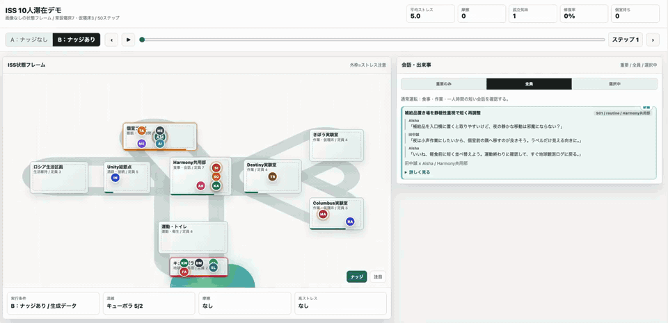
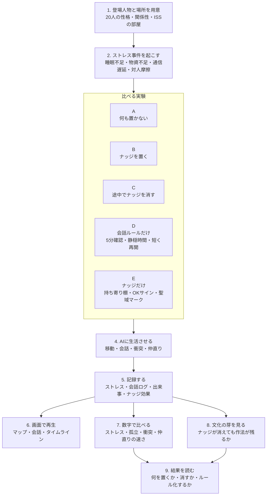

# GOOD ECHO｜善性を育む環境を設計したら、社会はどう変わるか？

## ISS Closed Habitat Stress Simulator

**Demo:** [GitHub Pagesで開く](https://karesansui-u.github.io/hackathon-singulab-inu/visualization/iss_habitat_demo.html)

GOOD ECHOは、善性を個人の性格だけに任せず、空間・物・ルール・会話の設計によって育てられるかを検証するシミュレーションプロジェクトです。

このREADMEでは、その最初のデモとして、ISSのような閉鎖空間でLLMエージェントがどのようにストレスを受け、会話し、協力し、衝突し、修復するかを観測する **ISS Closed Habitat Stress Simulator** を紹介します。

もともとのテーマは「善性を育む環境設計」ですが、このデモはより広く、**高ストレス環境を強制構築して、心理と関係の崩壊を環境設計でどう防げるかを試すプロダクト**として設計しています。

## 公開デモ

GitHub Pagesで公開しています。

https://karesansui-u.github.io/hackathon-singulab-inu/visualization/iss_habitat_demo.html

UI上部のセレクトボックスから、20人/100ステップ、10人/50ステップ、ナッジ撤去後Run C、ルールのみRun D、ナッジのみRun Eを切り替えられます。



高解像度版は [MP4動画](assets/iss20_100_demo.mp4) を開いてください。

## コンセプト

一時的なルール強化や秩序だけでは、閉鎖空間の問題は解けません。避難所、病棟、介護施設、寮、企業の高圧プロジェクト環境では、物理的な狭さ、睡眠不足、役割負荷、プライバシー不足、情報不足が積み重なり、人の判断や関係性が壊れていきます。

このプロジェクトでは、その崩壊過程をLLMエージェントで再現し、環境側の介入、つまりナッジオブジェクトや空間配置、運用ルールがどれだけ関係修復や協力行動を生むかをA/B比較します。

## デモで見るもの

- 複数人のISSクルーが、閉鎖環境で生活する過程をステップごとに追う
- Run Aではナッジなし、Run Bでは善性オブジェクトありで比較する
- ストレス、混雑、睡眠、会話、衝突、修復、ナッジ効果を可視化する
- 会話ログから「誰がどう考え、どう行動したか」を追える
- イベントタイムラインとナッジ効果から「何が効いたのか」を確認できる

現行UIは [visualization/iss_habitat_demo.html](visualization/iss_habitat_demo.html) です。

## 実験パイプライン

登場人物と閉鎖空間を用意し、あえてストレス事件を起こし、AIエージェントの会話から「何を置くと関係が壊れにくいか」を調べます。



この図で見たいのは、単に「ナッジありの方がよいか」ではありません。何を置くとストレスが下がるのか、何を消しても文化として残るのかを分けて見ます。

| Run | 条件 | 見たいこと |
|---|---|---|
| A | 何も置かない | 閉鎖空間だけで、どこから衝突や孤立が起きるか |
| B | ナッジを置く | 物や場所があると、仲直りやストレスがどう変わるか |
| C | 途中でナッジを消す | 物が消えても、身についた作法が残るか |
| D | 会話ルールだけ | 「5分だけ確認する」「静穏時間を置く」「長く説得せず短く再開する」だけで、どこまで関係を修復できるか |
| E | ナッジだけ | 持ち寄り棚、話しかけてOKサイン、個室聖域マーク、リソース・スコアボード、移動投票パネルだけで、物をきっかけに戻れるか |

## なぜISSか

ISSは、閉鎖空間ストレスを扱う題材としてわかりやすい環境です。

- 空間が狭く、逃げ場が少ない
- 睡眠、作業、食事、通信、運動が同じ環境内で連続する
- 小さな摩擦がチーム全体に波及しやすい
- 個人の不調と集団の安全が直結する
- 環境オブジェクトや運用設計による介入余地がある

この構造はISSに限らず、災害避難所、病棟、介護施設、寮、船舶、研究施設、高圧プロジェクトチームなどにも転用できます。

## シミュレーション設計

現行デモは、20人/100ステップのA/B比較を主表示にしています。比較用に10人/50ステップの軽量run、ナッジ撤去後の10人/100ステップRun C、20人/100ステップのRule Only / Nudge Only比較Run D/Eも同じUIで切り替えられます。人数、ステップ数、ストレスイベントの密度、終盤トラブルの強度は差し替えられる前提です。

### Run A: 対照群

ナッジオブジェクトを置かず、通常の閉鎖空間ストレスだけで進行します。混雑、疲労、作業負荷、会話の偏り、衝突、孤立がどのように発生するかを観測します。

### Run B: 介入群

ISS内に善性を促すナッジオブジェクトを配置します。たとえば、共同食の記録、静穏時間の合図、個室利用の公平化、感謝の可視化、修復会話のきっかけなどです。

Run AとRun Bを比較することで、単なる雰囲気ではなく、次のような差分を測ります。

- 衝突後に修復会話が起きたか
- 会話が一部の人に偏らず、相互性が増えたか
- 孤立するエージェントが減ったか
- 高ストレス時にチームが崩れるか、支え合うか
- どのナッジが、どのタイミングで効いたか

### Run C/D/E: 追加検証

Run Cでは、前半に配置したナッジオブジェクトを後半で撤去し、物理オブジェクトが消えた後も会話作法や修復文化が残るかを観測します。

Run D/Eでは、短く終われる会話ルールだけでも効くのか、ナッジオブジェクトだけで何が変わるのかを切り分けます。Run Dはルールのみ、Run Eはナッジのみです。

## UI

デモ画面では、ISSの生活空間をマップとして表示し、ステップごとに状態が更新されます。

- 左側: ISS habitatマップ
- 右側: 会話と出来事ログ
- 下部: 選択中のエージェント、参加者、運用・ナッジ状況
- 追加パネル: イベントタイムライン、ナッジ効果

ナッジオブジェクトはほわほわ点滅する立体風オブジェクトとして表示されます。衝突やトラブルはギザギザのアニメーションで表示し、発生箇所と影響を直感的に見られるようにしています。

## クイックスタート

### 1. domain packを検証する

```bash
python3 -m sim_core validate \
  --pack domain_packs/iss_benevolence \
  --scenario run_b
```

### 2. デモUIを開く

```bash
open visualization/iss_habitat_demo.html
```

`file://` で開いた場合は、HTML内のフォールバックデータで表示されます。`outputs/runs/iss_habitat_run_a` と `outputs/runs/iss_habitat_run_b` の生成データを読み込ませたい場合は、ローカルサーバー経由で開きます。

```bash
python3 -m http.server 8000
```

ブラウザで次を開きます。

```text
http://localhost:8000/visualization/iss_habitat_demo.html
```

### 3. ISS実験を実行する

```bash
python3 scripts/run_profile.py \
  --pack domain_packs/iss_benevolence \
  --scenario run_b \
  --profile cursor_smoke_b
```

利用できる主なプロファイルは [domain_packs/iss_benevolence/domain.yaml](domain_packs/iss_benevolence/domain.yaml) にあります。Claude、Codex、Cursorのプロファイルを登録済みです。Ollamaはエンジン側では対応済みなので、ISS用のOllama設定を追加すればローカルLLMでも実行できます。

### 4. Habitat UI用データを書き出す

```bash
python3 scripts/export_habitat_frames.py \
  --pack domain_packs/iss_benevolence \
  --scenario run_b \
  --run-id run_b \
  --state-tsv outputs/runs/iss_nudge_smoke_state/societal_state.tsv \
  --output-dir outputs/runs/iss_habitat_run_b
```

書き出される主なファイル:

- `habitat_frames.jsonl`: ステップごとのUI状態
- `agent_positions.tsv`: エージェント位置
- `module_occupancy.tsv`: 部屋ごとの混雑
- `messages.jsonl`: 発話ログ
- `conversation_threads.tsv`: 会話スレッド
- `event_timeline.tsv`: 重要イベント
- `nudge_effects.tsv`: ナッジ効果

## リポジトリ構成

```text
domain_packs/iss_benevolence/
  domain.yaml
  data/
  prompts/
  scenarios/
  viewer/

docs/ISS/
  experiment_design_iss_b_main_10agents_50steps.md
  experiment_design_iss_20agents_100steps.md
  personas_iss_10agents.md
  places_iss_design.md
  iss_objects_menu.md

examples/spatial_demo/
  main.py
  llm_backends.py
  ollama_client.py
  configs/

scripts/
  run_profile.py
  build_state.py
  run_agents.py
  export_habitat_frames.py
  export_domain_bundle.py

visualization/
  iss_habitat_demo.html

outputs/runs/
  iss_habitat_run_a/
  iss_habitat_run_b/
```

## 差し替え可能な設計

ISSはこのプロダクトの最初の題材です。構造としては、別の閉鎖空間にも差し替えられるようにしています。

差し替えられるもの:

- 人物: ペルソナ、役割、疲労しやすさ、関係性
- 空間: 部屋、動線、混雑条件、プライバシー条件
- イベント: 睡眠不足、作業遅延、通信不良、物資不足、対人トラブル
- ナッジ: 感謝、静穏、食事、休息、公平性、修復会話のきっかけ
- 評価指標: 相互性、修復率、孤立、負荷公平性、衝突後の回復

将来的には、ストレスイベントを弱・中・大のように強度別に挿入し、終盤で「チームは強くなったのか、それとも崩壊したのか」を比較できる形に拡張できます。

### 新しいドメインへの差し替え

災害避難所や病棟のように、ISSとは別の空間へ展開する場合も、会話ログやイベントタイムラインのフレームはそのまま使えます。`conversation_threads.tsv` は1会話1row、`messages.jsonl` は1発話1row、`habitat_frames.jsonl` は1step1rowという構造です。

カラム名の `module_id` はISSのモジュールだけを意味するものではなく、実質的には `place_id` / `zone_id` として使えます。たとえば災害避難所なら、`gym_floor`、`medical_corner`、`food_line`、`quiet_area`、`restroom_queue` のような場所IDに置き換えられます。

新しいドメインで主に差し替えるもの:

- `agents.tsv`: 避難者、医療者、運営担当、子ども、高齢者など
- `places_*.tsv`: 体育館、受付、物資配布、医療スペース、静養エリア、トイレ列など
- `objects_menu.tsv`: 受付掲示、静音札、物資残量ボード、相談カード、順番整理札など
- `events_run_a.tsv` / `events_run_b.tsv`: 余震、通信不通、物資不足、体調不良、列割り込み、家族不安など
- `prompts/system_context.md`: そのドメインの前提、制約、禁止したい振る舞い
- `prompts/agent_observation.md`: その場で観測したい心理、行動、会話の粒度

現行の [visualization/iss_habitat_demo.html](visualization/iss_habitat_demo.html) はISS提出用に特化したviewerです。したがって、災害避難所などへ本格展開する場合は、domain packの差し替えに加えて、viewer側の部屋配置・表示名・凡例を新ドメイン用に差し替えます。schemaと出力フレームは汎用化しやすい一方で、見た目のマップはドメインごとの体験に合わせる設計です。

## 終盤イベントだけを差し替える

このデモは、全体を作り直さなくても、最後のストレステストだけを差し替えられる設計です。現行のRun Bでは、S45-S50を「帰還準備」とし、S46に `帰還前の助言` を入れています。

現行パターン:

- S45-S50: 帰還準備。帰還後の評価、不安、別れ、感謝が同時に強まる
- S46: 年長者の助言が、緊張している相手には押しつけに聞こえる
- S47-S49: 持ち寄り棚の写真や記録を介して、助言ではなく経験共有として話し直す

この終盤だけを、次のような別パターンに置き換えられます。

- 睡眠不足: 連続する浅い睡眠で、声量・順番・作業ミスへの反応が強くなる
- 設備不具合: CO2センサー、空調、通信端末などの不具合で、誰が対応するかが争点になる
- 物資不足: 水・食料・補給品の残量が見え、節約が協力ではなく責めに変わる
- 通信遅延: 家族や地上管制との通信が遅れ、不安・誤解・評価恐怖が増える
- 緊急作業割り込み: 休息や食事の予定が崩れ、誰が代わるか、誰が休むかで摩擦が起きる

差し替える場所は [domain_packs/iss_benevolence/data/events_run_b.tsv](domain_packs/iss_benevolence/data/events_run_b.tsv) です。基本的には、終盤の `BASE05`、`CONF06`、`REPB06` を別のイベントに置き換えます。

例:

```tsv
BASE05  45  50  baseline  通信遅延下の帰還準備  0.68  全員  不安↑ 誤解↑  地上との通信が遅れ、帰還前の不安と確認不足が重なる。
CONF06  46  46  conflict  通信遅延による確認衝突  0.70  ISS08;ISS09  焦り↑ 押しつけ感↑  地上からの返答が遅れ、確認を急ぐ人と待ちたい人がぶつかる。
REPB06  47  49  repair  通信遅延下の修復  0.24  ISS08;ISS09  役割再調整↑ 安心回復↑  返答を待つ間の役割と声かけ頻度を短く決め直す。
```

この場合、人物・空間・ナッジ・UIを1から作り直す必要はありません。変更した終盤イベントに対して、該当ステップの会話を再生成し、`export_habitat_frames.py` でUI用データを書き出します。A/B比較を保ちたい場合は、Run Aにも同じ外乱を入れ、Run Bだけナッジありにします。

## 評価の見方

このデモで重要なのは、単にきれいな会話が出るかではありません。見たいのは、高ストレス下での思考と行動の変化です。

- 事件が起きたとき、誰が助けを求めるか
- 誰が場をつなぎ、誰が沈黙するか
- 衝突後に謝罪、説明、再調整が起きるか
- ナッジがあることで、会話や行動の流れが変わるか
- 最後の数ステップで、チームが崩れるか、支え合うか

この観測によって、「善性」は性格だけで決まるものではなく、環境と運用によって育つのではないか、という仮説を検証します。

## 参照ドキュメント

- [ISS実験 実行仕様 Bメイン](docs/ISS/experiment_design_iss_b_main_10agents_50steps.md)
- [ISS 20 agents / 100 steps 上位設計](docs/ISS/experiment_design_iss_20agents_100steps.md)
- [ISS 10人ペルソナ](docs/ISS/personas_iss_10agents.md)
- [ISS場所設計](docs/ISS/places_iss_design.md)
- [ISSオブジェクトメニュー](docs/ISS/iss_objects_menu.md)
- [ISS domain pack README](domain_packs/iss_benevolence/README.md)

## ライセンス

GNU General Public License v3.0
